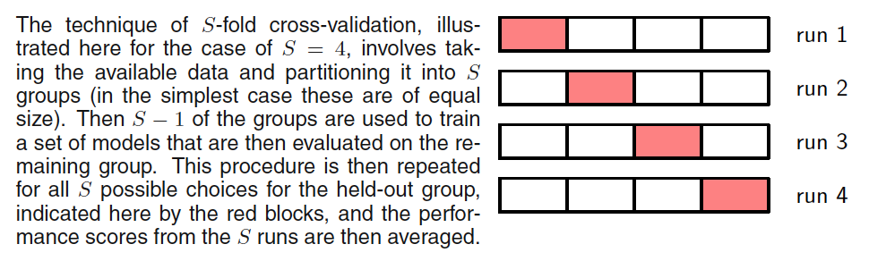
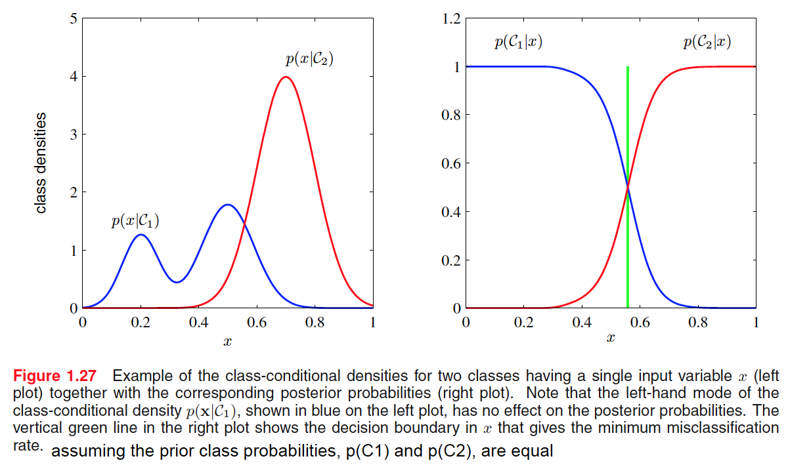

# ch01

#### RL concepts

* **exploration**

  the system tries out **new kinds of actions** to see how effective they are

* **exploitation**

  the system makes use of actions that are **known** to yield a high reward

#### linear model

* linear in the **unknown** parameters

* the coefficient $\lambda$ governs the **relative importance** of the regularization term compared with the sum-of-squares error term

* often the coefficient $w_{0}$ is ommited from the regularizer because **its inclusion causes the results to depend on the choice of origin for the target variableor**

  it may be included but with its own regularization coefficient

#### Jacobian factor

* let $x = g(y)$, then $f(x)$ becomes $\tilde{f}(y) = f(g(y))$

* $p_{x}(x) \delta x \simeq p_{y}(y) \delta y$

* $p_{y}(y) = p_{x}(x)\left|\frac{\text{d}x}{\text{d}y}\right| = p_{x}(g(y))\left|g'(y)\right|$

* the concept of the maximum of a probability density is **dependent on the choice of variable**

#### *Bayes' theorem*

* we derive the *Bayes' theorem* from the **symmetry property** $p(X,Y) = p(Y,X)$

* the term $p(X)$ are viewed as **normalization constant**

* we would like to address and quantify the uncertainty that surrounds the appropriate choice for the model parameters $\textbf{w}$

* from a *Bayesian* perspective, we can use the machinery of probability theory to describe **the uncertainty in model parameters** such as $\textbf{w}$, or **indeed in the choice of model itself**

* $p(\mathcal{D}|\textbf{w})$

  the likelihood is ***not a probability distribution*** over $\textbf{w}$, and its integral with respect to $\textbf{w}$ does not (necessarily) equal one

#### *maximum likelihood*

* choosing the value of $\textbf{w}$ for which the probability of the observed data set is maximized

#### *error function*

* the ***negative*** log of the likelihood function

* because the negative logarithm is a **monotonically decreasing** function, **maximizing the likelihood is equivalent to minimizing the error**

#### a criticism of the *Bayesian* approach

* One common criticism of the *Bayesian* approach is that the prior distribution is often selected on the basis of mathematical convenience rather than as a reflection of any prior beliefs.

* Even the subjective nature of the conclusions through their **dependence on the choice of prior** is seen by some as **a source of difficulty**.

* Reducing the dependence on the prior is one motivation for so-called ***noninformative*** priors.

* However, these lead to difficulties when comparing different models, and indeed ***Bayesian*** methods based on poor choices of prior can give poor results with high confidence.

#### probability

* the maximum of a distribution is known as its **mode**

* it would seem more natural to maximize the probability of the parameters given the data, not the probability of the data given the parameters

* the product of a large number of small probabilities can easily **underflow** the numerical precision of the computer, and this is resolved by computing instead the sum of the log probabilities

* in the case of the Gaussian distribution the solution for $\mu$ **decouples** from that for $\sigma^{2}$

* the issue of **bias in maximum likelihood** lies at the root of the over-fitting problem

* **conditional independence**

  the independence holds when the distribution is **conditioned**, for instance,

  $$
    p(\textbf{x}_{\text{I}}, \textbf{x}_{\text{B}} | \mathcal{C}_{k}) =
    p(\textbf{x}_{\text{I}} | \mathcal{C}_{k})
    p(\textbf{x}_{\text{B}} | \mathcal{C}_{k})
  $$

  the particular conditional independence assumption is an example of the *naive Bayes model*

#### *i.i.d*

* data points that are drawn **independently from the same distribution**

#### Curve fitting re-visited

* **we can express our uncertainty over the value of the target variable using a probability distribution**

* **the sum-of-squares error function has arisen as a consequence of maximizing likelihood under the assumption of a Gaussian noise distribution**

* *predictive distribution* give the probability distribution over $\text{t}$, rather than simply a point estimate

#### *maximum posterior (MAP)*

* maximizing the posterior distribution

#### model selection

* In a practical application, we need to determine the values of such parameters, and the principal objective in doing so is usually to achieve the best predictive performance on new data.

* Furthermore, as well as finding the appropriate values for complexity parameters within **a given model**, we may wish to consider **a range of different types of model** in order to find the best one for our particular application.
* if the validation set is small, it will give a relatively noisy estimate of predictive performance

* *cross-validation*

  

  *leave-one-out*: the case $S = N$

  the number of training runs that must be performed is increased by a factor of $S$

  A further problem with techniques such as cross-validation that use **separate** data to assess performance is that we might have **multiple complexity parameters** for **a single model** (for instance, there might be several regularization parameters).

#### the curse of dimensionality

* For a polynomial of order $M$, the growth in the number of coefficients is like $D^{M}$.

* Our geometrical intuitions, formed through a life spent in a space of three dimensions, can fail badly when we consider spaces of higher dimensionality.

* in spaces of high dimensionality, most of the volume of a sphere is concentrated in a thin shell near the surface

  for large $D$ the probability mass of the Gaussian is concentrated in a thin shell

* real data will often be confined to a region of the space having **lower effective dimensionality**, and in particular the directions over which important variations in the target variables occur may be so confined.

* real data will typically exhibit some **smoothness properties** (at least **locally**) so that for the most part small changes in the input variables will produce small changes in the target variables, and so we can exploit **local interpolation-like techniques** to allow us to make predictions of the target variables for new values of the input variables

#### decision theory

* take a specific action **based on** our understanding of the values $\textbf{t}$ is likely to take

* **inference**

  determination of $p(\textbf{x}, \textbf{t})$ from a set of training data is an example of inference

* **decision**

  how to make optimal decisions given the appropriate probabilities

* **decision regions**

  regions $\mathcal{R}_{k}$ called decision regions such that all points in $\mathcal{R}_{k}$ are assigned to class $\mathcal{C}_{k}$

* **decision boundaries/surfaces**

  the boundaries between decision regions

  each decision region need not be contiguous but could comprise some number of disjoint regions

* in order to minimize $p(\text{mistake})$, if $p(\textbf{x}, \mathcal{C}_1) > p(\textbf{x}, \mathcal{C}_{2})$ for a given value of $\textbf{x}$, then we should assign that $\textbf{x}$ to class $\mathcal{C}_1$

* a **loss function**, also called a **cost function**, which is a **single**, **overall** measure of loss incurred in taking any of the available decisions or actions

* the loss function depends on the true class, which is unknown.
  for a given input vector $\textbf{x}$, our **uncertainty** in the true class is expressed through the joint probability distribution $p(\textbf{x}, \mathcal{C}_{k})$ and so we seek instead to minimize the average loss

* **reject option**

  it will be appropriate to avoid making decisions on the difficult cases in anticipation of a lower error rate on those examples for which a classification decision is made

  setting $\theta = 1$ will ensure that all examples are rejected, whereas if there are $K$ classes then setting $\theta < 1/K$ will ensure that no examples are rejected

* **inference stage**

  we use training data to learn a model for $p(\textbf{x}, \mathcal{C}_{k})$

* **decision stage**

  we use these posterior probabilities to make **optimal** class assignments

* **discriminant function**

  solve both problems together and simply learn a function that maps inputs $\textbf{x}$ **directly** into decisions

  find a function $f(x)$, called a discriminant function, which maps each input $\textbf{x}$ directly onto a class label

  for instance, in the case of two-class problems, $f(·)$ might be binary valued and such that $f = 0$ represents class $\mathcal{C}_{1}$ and $f = 1$ represents class $\mathcal{C}_{2}$

  **In this case, probabilities play no role.**

* **generative model**

  approaches that explicitly or implicitly **model the distribution** of inputs as well as outputs,

  i.e.,

  first solve the the inference problem of determining the class-conditional densities $p(\textbf{x} | \mathcal{C}_{k})$ for each each class $\mathcal{C}_{k}$ individually

  also separately infer the prior class probabilities $p(\mathcal{C}_{k})$

  $$
    p(\mathcal{C}_{k} | \textbf{x}) =
    \frac{p(\textbf{x} | \mathcal{C}_{k})p(\mathcal{C}_{k})}{p(\textbf{x})}
  $$

* one advantage of **generative model** is that it also allows the **marginal density** of data $p(\textbf{x})$ to be determined from

  $$
    p(\textbf{x})=
    \sum_{k}p(\textbf{x} | \mathcal{C}_{k})p(\mathcal{C}_{k})
  $$

* equivalently, we can model the joint distribution $p(\textbf{x}, \mathcal{C}_{k})$ directly and then normalize to obtain the posterior probabilities.

* this can be useful for detecting new data points that have **low probability** under the model and for which the predictions may be of low accuracy, which is known as **outlier detection** or **novelty detection**
  
* **discriminative models**

  approaches that **model the posterior probabilities directly**

* the class priors $p(\mathcal{C}_{k})$ can often be estimated simply from the fractions of the training set data points in each of the classes

* if we **only** wish to make classification decisions, then it can be wasteful of computational resources, and excessively demanding of data, to find the joint distribution $p(\textbf{x}, \mathcal{C}_{k})$ when in fact we only really need the posterior probabilities $p(\mathcal{C}_{k} | \textbf{x})$, which can be obtained directly through **discriminative models**

* the classconditional densities may contain a lot of structure that has **little** effect on the posterior probabilities

  
  
* there are many powerful reasons for wanting to compute the posterior probabilities, even if we subsequently use them to make decisions

  * **minimizing risk**

    a problem in which the elements of the **loss matrix** are subjected to revision from time to time

    $$\sum_{k}L_{kj}p(C_{k} | k)$$

  * **reject option**

    posterior probabilities allow us to determine a rejection criterion that will minimize the misclassification rate, or more generally the expected loss, for a given fraction of rejected data points

  * **compensating for class priors**

    **a balanced data set** in which we have selected equal numbers of examples from each of the classes would allow us to find a more accurate model

    the posterior probabilities are **proportional to the prior probabilities**, so we can compensate for the effects of our modifications to the training data

  * **combining models**
  
    for complex applications, we may wish to break the problem into **a number of smaller subproblems** each of which can be tackled by a separate module

    often under the assumption of **conditional independent**

* loss functions for regression

  * **regression function**

    in the case of squared loss, the conditional average of $t$ conditioned on $t$, i.e., $\mathbb{E}_{t}[t | \textbf{x}]$

  * $$
    \begin{aligned}
      \mathbb{E}[L]
      =& \iint L(t, y(\textbf{x})) p(\textbf{x}, t) \mathrm{d} \textbf{x} \mathrm{d} t \\
      =& \iint \{y(\textbf{x}) - t \}^{2} p(\textbf{x}, t) \mathrm{d} \textbf{x} \mathrm{d} t
    \end{aligned}
    $$

  * $\frac{\delta \mathbb{E}[L]}{\delta y(\textbf{x})} = 2 \int \{ y(\textbf{x}) - t \} p(\textbf{x}, t) \mathrm{d} t = 0$

  * $y(\textbf{x}) = \frac{\int t p(\textbf{x}, t) \mathrm{d} t} {p(\textbf{x})} = \int t p(t | \textbf{x}) \mathrm{d} t = \mathbb{E}_{t}[t | \textbf{x}]$
  
  * $$
    \begin{aligned}
      & \{ y(\textbf{x}) - t \}^{2} \\
      =& \{ y(\textbf{x}) -\mathbb{E}_{t}[t | \textbf{x}] + \mathbb{E}_{t}[t | \textbf{x}]- t \}^{2} \\
      =& \{ y(\textbf{x}) - \mathbb{E}_{t}[t | \textbf{x}] \}^{2} + 2\{y(\textbf{x}) - \mathbb{E}_{t}[t | \textbf{x}] \} \{ \mathbb{E}_{t}[t | \textbf{x}] - t \} + \{ \mathbb{E}_{t}[t | \textbf{x}] - t \}^{2}
    \end{aligned}
    $$

  * substituting into the loss function and performing the integral over t, we see that **the cross-term vanishes** and we obtain an expression for the loss function in the form

  * $\mathbb{E}[L] = \int \{ y(\textbf{x}) - \mathbb{E}_{t}[t | \textbf{x}] \}^{2} p(\textbf{x}) \mathrm{d} \textbf{x} + \int var[t | \textbf{x}] p(\textbf{x}) \mathrm{d} \textbf{x}$

  * the function $y(\textbf{x})$ we seek to determine enters only in the first term, which will be minimized when $y(\textbf{x})$ is equal to $\mathbb{E}_{t}[t | \textbf{x}]$, in which case this term will vanish.

  * The second term is the **variance** of the distribution of $t$, averaged over $\textbf{x}$.

    It represents the **intrinsic variability** of the target data and can be regarded as noise.

    Because it is independent of $y(\textbf{x})$, it represents the **irreducible minimum value** of the loss function.

* the multimodal issue often arises in the solution of inverse problems

* *Minkowski* loss

  * $\mathbb{E}[L_{q}] = \iint {\left| y(\textbf{x}) - t \right|}^{q} p(\textbf{x}, t) \mathrm{d} \textbf{x} \mathrm{d} t$

  * The minimum of $\mathbb{E}[L_{q}]$ is given by the conditional **mean** for $q = 2$, the conditional **median** for $q = 1$, and the conditional **mode** for $q \to 0$.

#### Information Theory

* the amount of information can be viewed as the *‘degree of surprise’*

* a quantity $h(x)$ that is a **monotonic** function of the probability $p(x)$ and that expresses the information content

* The form of $h(·)$ can be found by noting that if we have two events $x$ and $y$ that are unrelated, then the information gain from observing both of them should be the sum of the information gained from each of them separately, so that $h(x, y) = h(x) + h(y)$.

  Two unrelated events will be statistically independent and
so $p(x, y)$ = $p(x)p(y)$.

* ***entropy**: a measureof disorder*

  note that $\lim_{p \to 0} p \log_{2}p = 0$

  $$H[x] = - \sum_{x} p(x) \log_{2}p(x)$$

* we can take advantage of the **nonuniform** distribution by using shorter codes for the more probable events, at the expense of longer codes for the less probable events, in the hope of getting a shorter average code length

* the *noiseless coding theorem* (Shannon, 1948) states that the entropy is a **lower bound** on the number of bits needed to transmit the state of a random variable.

* ***multiplicity**: the weight of the macrostate*

  $$W = \frac{N!}{\prod_{i} n_{i}!}$$

* the entropy is then defined as the logarithm of the multiplicity **scaled** by an appropriate constant

  $$H = \frac{1}{N} \ln W = \frac{1}{N} \ln N! - \frac{1}{N} \sum_{i} \ln n_{i}!$$

* *differential entropy*

  $$H[\textbf{x}] = - \int p(\textbf{x}) \ln p(\textbf{x}) \mathrm{d} \textbf{x}$$

* The discrete and continuous forms of the entropy differ by a quantity $\ln \Delta$, which diverges in the limit $\Delta \to 0$.

  This reflects the fact that to specify a continuous variable very precisely requires a large number of bits.

* the distribution that maximizes the differential entropy is the Gaussian.

  If we evaluate the differential entropy of the Gaussian, we obtain

  $$H[x] = \frac{1}{2}\{ 1 + \ln(2 \pi \sigma^{2} \}$$

  the entropy increases as the distribution becomes broader, i.e., as $\sigma^{2}$ increases

  this result also shows that the differential entropy, unlike the discrete entropy, can be negative, because $H(x) < 0$ in for $\sigma^{2} < 1/(2 \pi e)$

* *conditional entropy* of $\textbf{y}$ given $\textbf{x}$

  **expectation!!!**

  $$
  \begin{aligned}
    H[\textbf{y} | \textbf{x}]
    =&
    \sum_{i} p(\textbf{x}_{i}) H[\textbf{y} | \textbf{x} = \textbf{x}_{i}]  \\
    =& - \sum_{i} p(\textbf{x}_{i}) \sum_{j} p(\textbf{y}_{j} | \textbf{x}_{j}) \ln p(\textbf{y}_{j} | \textbf{x}_{j})  \\
    =& - \sum_{i} \sum_{j} p(\textbf{x}_{i}, \textbf{y}_{j}) \ln p(\textbf{y}_{j} | \textbf{x}_{j})
  \end{aligned}
  $$

  $$H[\textbf{x} , \textbf{y}] = H[\textbf{y} | \textbf{x}] + H[\textbf{x}]$$

* *relative entropy/Kullback-Leibler divergence/KL divergence*

  **a measure of the dissimilarity** of the two distributions $p(\mathbf{x})$ and $q(\mathbf{x})$

  Consider some **unknown** distribution $p(\textbf{x})$, and suppose that we have **modelled** this using an **approximating distribution** $q(\textbf{x})$.

  If we use $q(\textbf{x})$ to construct a **coding scheme** for the purpose of transmitting values of $\textbf{x}$ to a receiver, then the **average *additional* amount of information** (in nats) required to specify the value of $\textbf{x}$ as a result of using $q(\textbf{x})$ instead of the true distribution $p(\textbf{x})$ is given by

  $$
  \begin{aligned}
    KL(p || q)
    =&  - \int p(\textbf{x}) \ln q(\textbf{x}) \mathrm{d} \textbf{x} - ( - \int p(\textbf{x}) \ln p(\textbf{x}) \mathrm{d} \textbf{x})  \\
    =& - \int p(\textbf{x}) \ln \begin{Bmatrix} \frac{q(\textbf{x})}{p(\textbf{x})} \end{Bmatrix} \mathrm{d} \textbf{x}
  \end{aligned}
  $$

* $KL(p || q) \not\equiv KL(p || q)$

  $KL(p || q) \geqslant 0 \text{ with equality, if, and only if, } p(\textbf{x}) = q(\textbf{x})$

  *convex:* the second derivative of the function be everywhere positive

  *strictly convex:* if the equality is satisfied only for $\lambda = 0$ and $\lambda = 1$.

  $$
    f \begin{pmatrix} \sum_{i}^{M} \lambda_{i}x_{i}\end{pmatrix} \leqslant \sum_{i}^{M} \lambda_{i}f(x_{i})
  $$

* ***Jensen’s inequality***

  * if we interpret the $\lambda_{i}$ as the probability distribution over a discrete variable $x$ taking the values $x_{i}$

  $$f(\mathbb{E}[x]) \leqslant \mathbb{E}[f(x)]$$

  * using the fact that $-\ln x$ is strictly convex ,together with the normalization condition $\int q(\mathbf{x}) \mathrm{d} \mathbf{x} = 1$

  $$ KL(p || q) = - \int p(\textbf{x}) \ln \begin{Bmatrix} \frac{q(\textbf{x})}{p(\textbf{x})} \end{Bmatrix} \mathrm{d} \textbf{x} \geqslant -\ln \int q(\textbf{x}) \mathrm{d} \textbf{x} = 0$$

* There is an intimate relationship between **data compression** and **density estimation** (i.e., the problem of modelling an unknown probability distribution) because the most efficient compression is achieved when we know the true distribution.

  If we use a distribution that is different from the true one, then we must necessarily have a less efficient coding, and on **average** the **additional** information that must be transmitted is (at least) equal to the *Kullback-Leibler divergence* between the two distributions.

* Suppose we're trying to  approximate $p(\mathbf{x})$ using some parametric distribution $q(\mathbf{x} | \boldsymbol{\theta})$, governed by a set of **adjustable** parameters $\boldsymbol{\theta}$.

  We cannot do this directly because we don’t know $p(\mathbf{x})$.

  $$\begin{aligned}
    & \mathbb{E}[f] \simeq \frac{1}{N} \sum_{n=1}^{N} f(x_{n})  \\
    \implies & KL(p || q) \simeq \frac{1}{N} \sum_{n=1}^{N} \{ -ln q(\mathbf{x} | \boldsymbol{\theta}) + \ln p(\mathbf{x}) \}
  \end{aligned}$$

  The second term on the right-hand side is independent of $\boldsymbol{\theta}$, and the first term is the **negative log likelihood** function for $\boldsymbol{\theta}$ under the distribution $q(\mathbf{x} | \boldsymbol{\theta})$ evaluated using the training set.

* *mutual information*

  If the variables are **not independent**, we can gain some idea of whether they are **‘close’** to being independent by considering the *Kullback-Leibler divergence* between the joint distribution and the product of the marginals, given by

  $$\begin{aligned}
    \mathrm{I}[\mathbf{x}, \mathbf{y}]
    & \equiv KL(p(\mathbf{x}, \mathbf{y}) || p(\mathbf{x}) p(\mathbf{y}))  \\
    & = - \int p(\mathbf{x}, \mathbf{y}) \ln \begin{Bmatrix} \frac{p(\mathbf{x}) p(\mathbf{y})}{p(\mathbf{x}, \mathbf{y})} \end{Bmatrix} \mathrm{d} \mathbf{x} \mathrm{d} \mathbf{y}
  \end{aligned}$$

  $$
    \mathrm{I}[\mathbf{x}, \mathbf{y}] = H[\mathbf{x}] - H[\mathbf{x} | \mathbf{y}] = H[\mathbf{y}] - H[\mathbf{y} | \mathbf{x}]
  $$

  Thus we can view the mutual information as **the reduction in the uncertainty** about $\mathbf{x}$ by virtue of being told the value of $\mathbf{y}$ (or vice versa).

  From a Bayesian perspective, we can view $p(\mathbf{x})$ as the prior distribution for $\mathbf{x}$ and $p(\mathbf{x} | \mathbf{y})$ as the **posterior distribution** after we have observed new data $\mathbf{y}$.

  The mutual information therefore represents the reduction in uncertainty about $\mathbf{x}$ as a consequence of the new observation $\mathbf{y}$.

  

$$
  \boldsymbol{copyright@Jiawei}
$$
